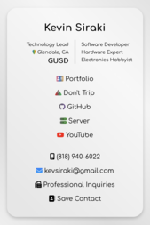

 </img>
# Portfolio

A unique portfolio website with a contact form and an easy-to-use file structure for you to work upon.

	Aimed towards promoting a simple yet effective paradigm, this portfolio features seperation of 
	concerns following the MVC approach and uses only vanilla JS and PHP. #dontusejsframeworksforeverything

<a href="https://www.kevinsiraki.com/"> Demo</a>

<h3>Structure</h3>
<ul>
  <li>contact/
   <ul>
    <li>Scalable Digital Contact Card</li>
	<li> </img></li>
   </ul>
  </li>
  <li>api/
    <ul>
      <li>API Endpoints</li>
    </ul>
  </li>
  <li>model/
    <ul>
      <li>Business Logic</li>
    </ul>
  </li>
  <li>controller/
    <ul>
      <li>API Controllers</li>
    </ul>
  </li>
  <li>db/
    <ul>
      <li>Database Configuration Files</li>
    </ul>
  </li>
  <li>views/
    <ul>
      <li>css/
        <ul>
          <li>Global CSS Styles/Fonts</li>
        </ul>
      </li>
      <li>js/
        <ul>
          <li>JS Scripts</li>
        </ul>
      </li>
	  <li>components/
        <ul>
          <li>JS Components</li>
        </ul>
      </li>
    </ul>
  </li>
  <li>Entry HTML/PHP File</li>
  <li>.env (Be sure to make your own .env file!)</li>
  <li>.git/root files</li>
</ul>
